# Portofolio & Service Portal — Ester Hasianna Nainggolan

Tugas Mandiri Minggu 4 — Pemrograman dan Pengujian Web (12S3101), Institut Teknologi Del.
Refactoring arsitektural dari portofolio statis (Minggu 3) menjadi aplikasi web **decoupled multi-tier** dengan **Dynamic Client-Side Rendering (CSR)**, disertai analisis kinerja jaringan dan keamanan sisi klien.

| | |
|---|---|
| **Nama / NIM** | Ester Hasianna Nainggolan / 12S24050 |
| **Dosen Pengampu** | Chandro Pardede, S.Kom., M.Sc. |
| **Live Deployment** | https://esterhasianna.github.io/ppw-2026-week2-12S24050/ |
| **Repositori** | https://github.com/EsterHasianna/ppw-2026-week2-12S24050 (branch `week4-architecture`) |

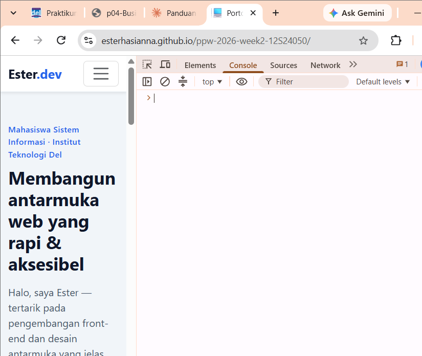

---

## 1. Ringkasan

Pada Minggu 3, seluruh kartu proyek, teks modal, dan katalog layanan ditulis langsung (*hardcoded*) di `index.html`. Pada Minggu 4, data dipindahkan ke berkas JSON modular yang bertindak sebagai *mock RESTful data layer*, lalu dimuat secara asinkron oleh JavaScript modern (`fetch()` + `async/await`). Hasilnya:

- `index.html` menjadi *shell* bersih tanpa kartu hardcoded.
- Satu **Universal Dynamic Modal** menggantikan empat modal statis.
- Empat **UI State** dikelola: Loading, Success, Empty, dan Error.
- Formulir layanan dikirim lewat **HTTP POST asinkron** (JSON DTO) tanpa reload halaman, dengan umpan balik Toast dan persistensi `localStorage`.
- Kinerja jaringan diukur (Cold vs Warm Load, TTFB, status 304) dan keamanan sisi klien diuji (DOM XSS dan Content Security Policy).

---

## 2. Arsitektur Sistem (C4 Container Model)

### 2.1 Diagram Container

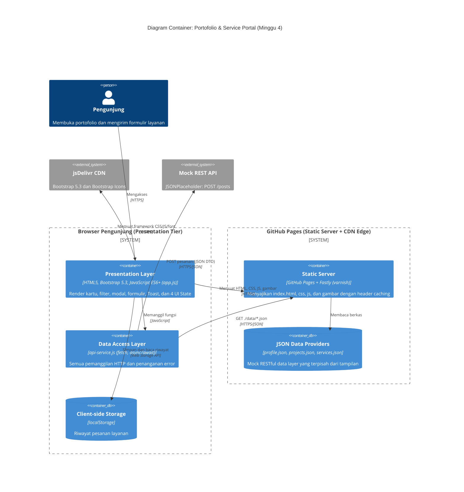
```mermaid
C4Container
  title Diagram Container: Portofolio & Service Portal (Minggu 4)

  Person(user, "Pengunjung", "Membuka portofolio dan mengirim formulir layanan")

  System_Boundary(browser, "Browser Pengunjung (Presentation Tier)") {
    Container(app, "Presentation Layer", "HTML5, Bootstrap 5.3, JavaScript ES6+ (app.js)", "Render kartu, filter, modal, formulir, Toast, dan 4 UI State")
    Container(apisvc, "Data Access Layer", "api-service.js (fetch, async/await)", "Semua pemanggilan HTTP dan penanganan error")
    ContainerDb(ls, "Client-side Storage", "localStorage", "Riwayat pesanan layanan")
  }

  System_Boundary(hosting, "GitHub Pages (Static Server + CDN Edge)") {
    Container(static, "Static Server", "GitHub Pages + Fastly (varnish)", "Menyajikan index.html, css, js, dan gambar dengan header caching")
    ContainerDb(json, "JSON Data Providers", "profile.json, projects.json, services.json", "Mock RESTful data layer yang terpisah dari tampilan")
  }

  System_Ext(cdn, "jsDelivr CDN", "Bootstrap 5.3 dan Bootstrap Icons")
  System_Ext(rest, "Mock REST API", "JSONPlaceholder: POST /posts")

  Rel(user, app, "Mengakses", "HTTPS")
  Rel(app, apisvc, "Memanggil fungsi", "JavaScript")
  Rel(app, ls, "Simpan dan baca riwayat", "Web Storage API")
  Rel(app, static, "Memuat HTML, CSS, JS, gambar", "HTTPS")
  Rel(app, cdn, "Memuat framework CSS/JS/font", "HTTPS")
  Rel(apisvc, static, "GET ./data/*.json", "HTTPS/JSON")
  Rel(static, json, "Membaca berkas")
  Rel(apisvc, rest, "POST pesanan (JSON DTO)", "HTTPS/JSON")
```

### 2.2 Diagram Urutan Pemuatan Halaman

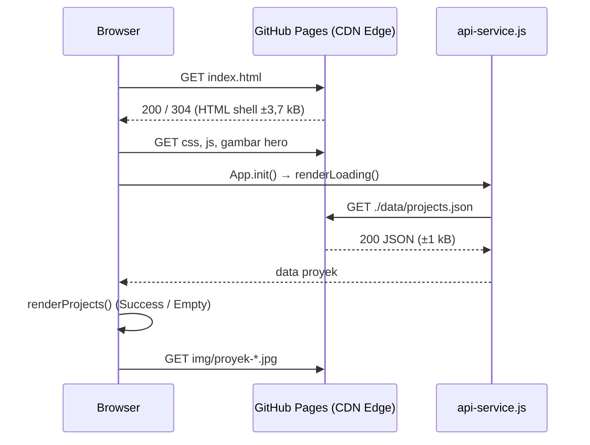
```mermaid
sequenceDiagram
  participant B as Browser
  participant S as GitHub Pages (CDN Edge)
  participant A as api-service.js
  B->>S: GET index.html
  S-->>B: 200 / 304 (HTML shell ±3,7 kB)
  B->>S: GET css, js, gambar hero
  B->>A: App.init() → renderLoading()
  A->>S: GET ./data/projects.json
  S-->>A: 200 JSON (±1 kB)
  A-->>B: data proyek
  B->>B: renderProjects() (Success / Empty)
  B->>S: GET img/proyek-*.jpg
```

### 2.3 Pemetaan Tier

| Tier | Komponen | Tanggung jawab |
|---|---|---|
| **Presentation** | `index.html`, `css/custom-style.css`, `js/app.js` | Antarmuka, rendering DOM, event, UI State, modal, Toast |
| **Application / Service Logic** | `js/api-service.js` | Kontrak akses data (GET JSON, POST DTO), validasi respons (`response.ok`), penanganan error |
| **Data Storage** | `data/*.json` (simulasi server), `localStorage` (sisi klien) | Penyimpanan data portofolio, layanan, dan riwayat pesanan |

### 2.4 Narasi Separation of Concerns

Prinsip *Separation of Concerns* memisahkan sistem menjadi bagian-bagian dengan satu tanggung jawab utama, sehingga perubahan pada satu bagian tidak memaksa perubahan pada bagian lain. Pada Minggu 3, struktur, isi, dan tampilan bercampur di satu berkas HTML; menambah satu proyek berarti menyunting markup langsung. Pada arsitektur baru, **isi** (JSON), **akses data** (`api-service.js`), dan **presentasi** (`app.js` + HTML/CSS) berdiri sendiri. Menambah proyek cukup dengan menambah satu objek pada `projects.json`; kartu, filter kategori, dan modal muncul otomatis tanpa mengubah kode. `app.js` tidak pernah memanggil `fetch()` langsung, sehingga jika sumber data berpindah ke REST API sungguhan, hanya `api-service.js` yang perlu disesuaikan (prinsip *loose coupling*).

### 2.5 Perbandingan Paradigma Rendering

| Parameter | SSR | CSR (dipakai di proyek ini) | Jamstack |
|---|---|---|---|
| Perakitan DOM | Di server per request | Di browser via JavaScript | Saat build dan di-*hydrate* lewat API |
| Beban server | Tinggi | Sangat rendah (hanya berkas statis) | Minimal (CDN edge) |
| TTFB | Menengah sampai lambat | Cepat (HTML *shell* kecil) | Cepat dari cache CDN |
| Interaktivitas | Reload tiap navigasi | Mulus | Mulus |
| Konsekuensi yang teramati | - | Gambar kartu baru diminta **setelah** `projects.json` diterima (rantai HTML → JS → JSON → gambar) | - |

Proyek ini menggabungkan **CSR** dengan hosting **statis di CDN** (pola Jamstack sederhana): HTML *shell* dilayani cepat, data diambil terpisah lewat JSON.

---

## 3. Struktur Proyek

```
ppw-2026-week2-12S24050/
├── index.html              # Shell HTML5 + Bootstrap 5, tanpa kartu hardcoded
├── css/
│   └── custom-style.css    # Custom style dan variabel tema
├── data/
│   ├── profile.json        # Data diri
│   ├── projects.json       # 4 proyek (title, category, description, tags, thumbnail, metrics, link)
│   └── services.json       # 3 paket layanan
├── js/
│   ├── api-service.js      # Data Access Layer: fetch + error handling
│   └── app.js              # Presentation Layer: DOM, UI State, modal, form, Toast
├── img/                    # Foto profil dan thumbnail proyek
├── screenshots/            # Bukti untuk README
└── README.md
```

---

## 4. Fitur yang Diimplementasikan

### 4.1 Dynamic CSR dan 4 UI State

| State | Kondisi | Bukti |
|---|---|---|
| **Loading** | Data sedang diambil (spinner + kartu skeleton) | *(singkat; jeda simulasi dimatikan untuk profiling)* |
| **Success** | Kartu dirender dari `projects.json` | 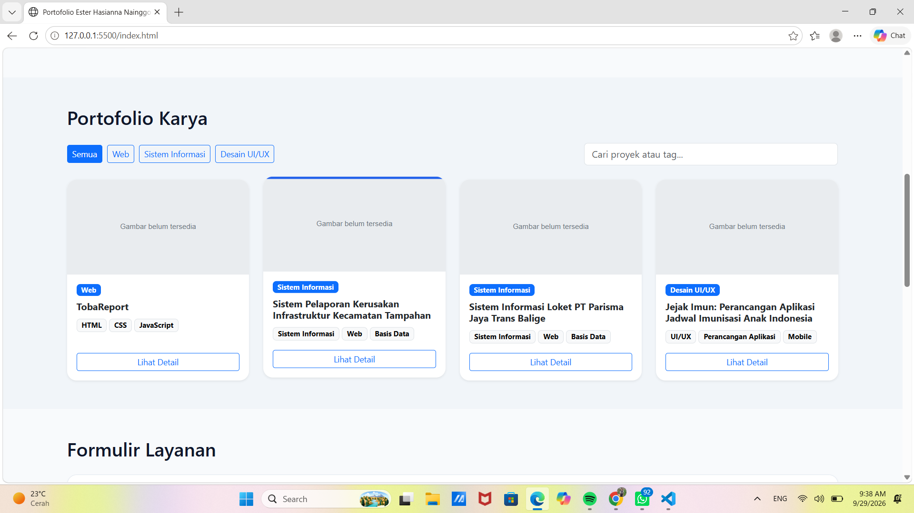 |
| **Empty** | Filter atau pencarian tidak menemukan hasil (dengan tombol *Reset Filter*) | 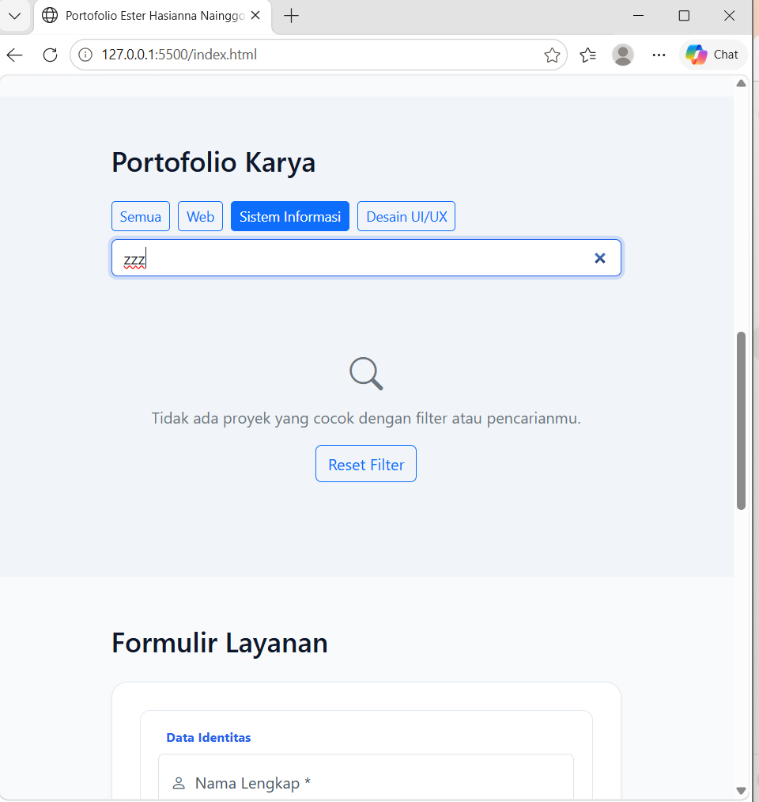 |
| **Error** | `fetch` gagal (alert merah + tombol *Coba Lagi*) | 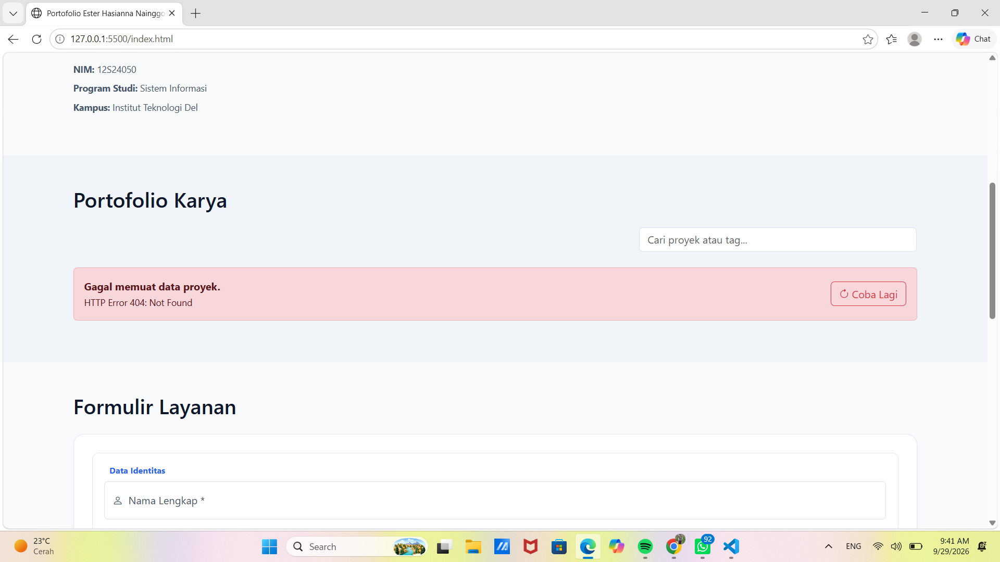 |

Filter kategori dibuat dinamis dari data (`Semua`, `Web`, `Sistem Informasi`, `Desain UI/UX`) dan berfungsi instan bersama kolom pencarian.

### 4.2 Universal Dynamic Modal

Hanya **satu** elemen modal (`#universalProjectModal`) di `index.html`. Tombol *Lihat Detail* membawa `data-project-id`; `app.js` mencari proyek berdasarkan ID, mengisi modal, lalu membukanya lewat `bootstrap.Modal.getOrCreateInstance()`. Semua nilai dinamis melewati `escapeHTML()`.

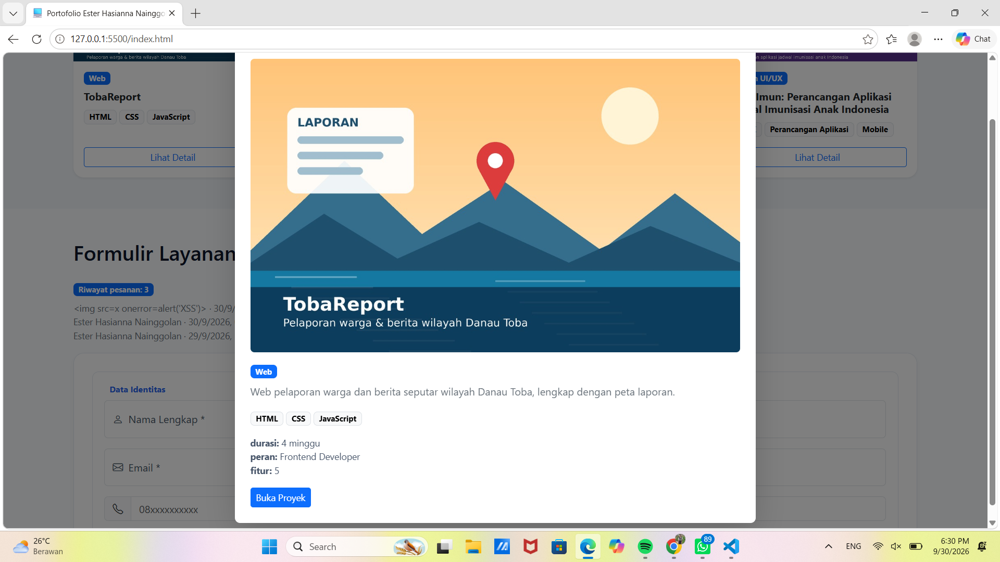

### 4.3 Formulir Asinkron, Toast, dan localStorage

Formulir layanan tidak lagi memicu *full page reload*. Alurnya: `preventDefault()` → validasi HTML5 → serialisasi `FormData` menjadi objek JSON (DTO) → `ApiService.submitServiceOrder()` (HTTP POST) → Toast → simpan ke `localStorage` → badge riwayat diperbarui. Tombol berubah menjadi spinner selama pengiriman.

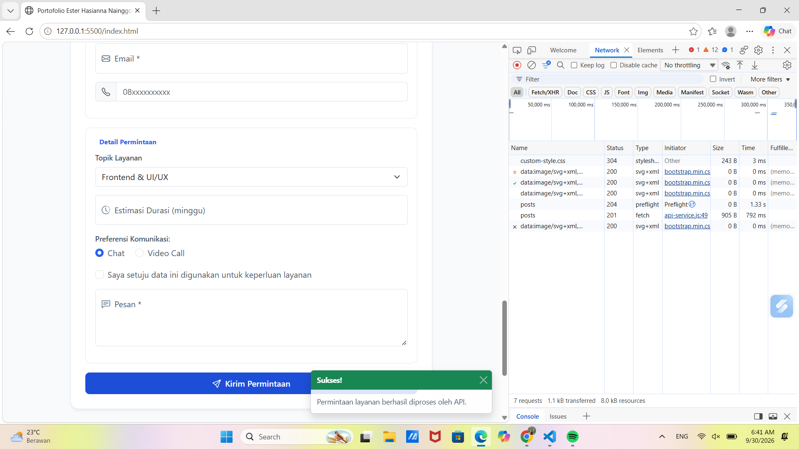
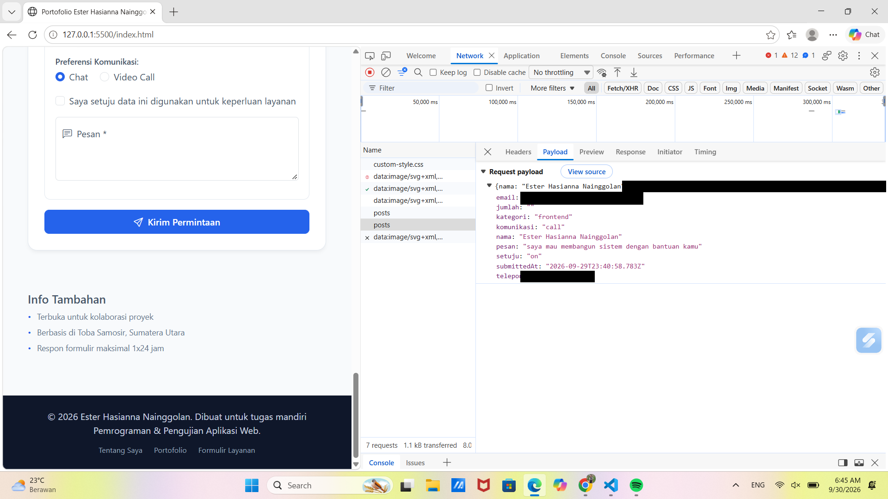
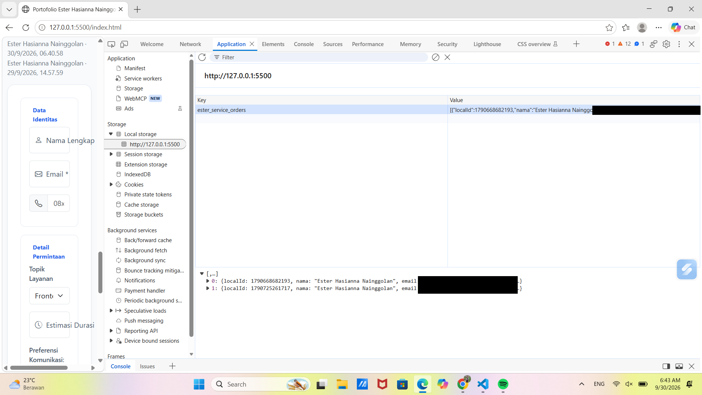

> Catatan: endpoint POST memakai JSONPlaceholder (mock API) yang membalas `201 Created` tetapi tidak menyimpan data. Persistensi nyata ada di `localStorage`.

---

## 5. Perbandingan Sebelum vs Sesudah Refactoring

| Aspek | Sebelum (Minggu 3) | Sesudah (Minggu 4) |
|---|---|---|
| Sumber data proyek | Hardcoded di `index.html` | `data/projects.json` (dimuat via `fetch`) |
| Rendering | HTML statis | Dynamic CSR (`async/await`) |
| Modal | 4 modal statis terpisah | **1** Universal Dynamic Modal |
| Menambah proyek | Menyunting HTML (kartu + modal) | Menambah 1 objek JSON |
| Filter dan pencarian | Tidak ada | Filter kategori + pencarian instan |
| UI State | Tidak ada | Loading, Success, Empty, Error |
| Formulir | Validasi saja, tanpa pengiriman | HTTP POST JSON asinkron + Toast |
| Persistensi | Tidak ada | `localStorage` + badge riwayat |
| Penanganan error jaringan | Tidak ada | `response.ok` + alert dengan tombol retry |
| Keamanan sisi klien | Tidak ada | `escapeHTML()` + Content Security Policy |
| Struktur berkas | `index.html` + `css` | `index.html`, `css/`, `data/`, `js/`, `img/` |
| Panjang `index.html` | ±380 baris | ±235 baris |
| Hosting | Lokal | GitHub Pages (CDN edge) |

---

## 6. Analisis Kinerja Jaringan (DevTools)

Pengukuran dilakukan pada situs online (`github.io`) memakai Chrome/Edge DevTools → tab **Network**. *Cold load*: **Disable cache** dicentang + `Ctrl+Shift+R`. *Warm load*: cache aktif + `F5`. Jeda simulasi pada `api-service.js` dimatikan (`SIMULATED_DELAY: 0`) agar angka tidak terdistorsi.

### 6.1 Cold Load vs Warm Load

| Metrik | Cold Load #1 | Cold Load #2 | Warm Load |
|---|---|---|---|
| Jumlah request | 17 | 16 | 17 |
| Data ditransfer | 714 kB | 712 kB | 142 sampai 152 B |
| Total resources | 1,1 MB | 1,1 MB | 1,1 MB |
| Finish | 5,66 s | 938 ms | 87 sampai 176 ms |
| DOMContentLoaded | 3,48 s | 366 ms | 50 ms |
| Load | 3,74 s | 386 ms | 73 ms |
| Status dokumen HTML | 200 (3,7 kB) | 200 (3,7 kB) | **304 Not Modified** (142 B) |
| Sumber berkas statis | Jaringan | Jaringan | `memory cache` / `disk cache` |

- **Penghematan bandwidth** pada warm load: 714 kB → ±150 B (**±99,98%**).
- **Penghematan waktu**: 5,66 s → 176 ms (**±96,9%**).
- **Dokumen HTML**: 3,7 kB → 142 B (**±96%**), sejalan dengan klaim "hingga 95%" pada modul.
- Angka cold load bervariasi antar percobaan karena kondisi jaringan dan status cache CDN; karena itu pengukuran diulang dan dilaporkan seluruhnya.

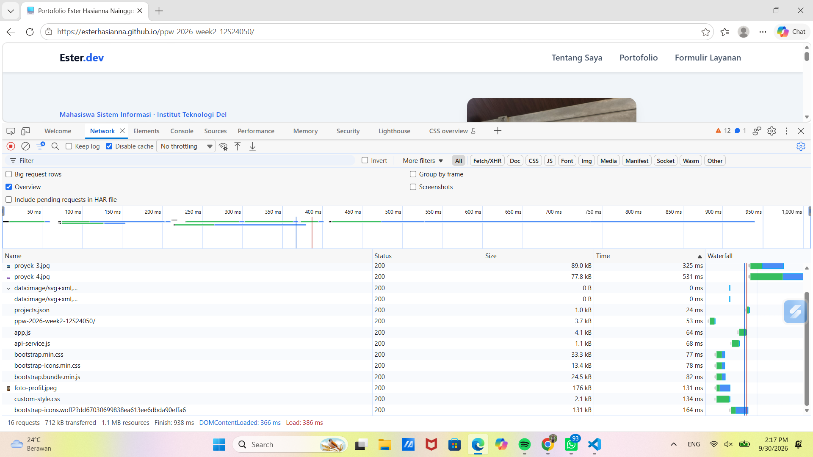
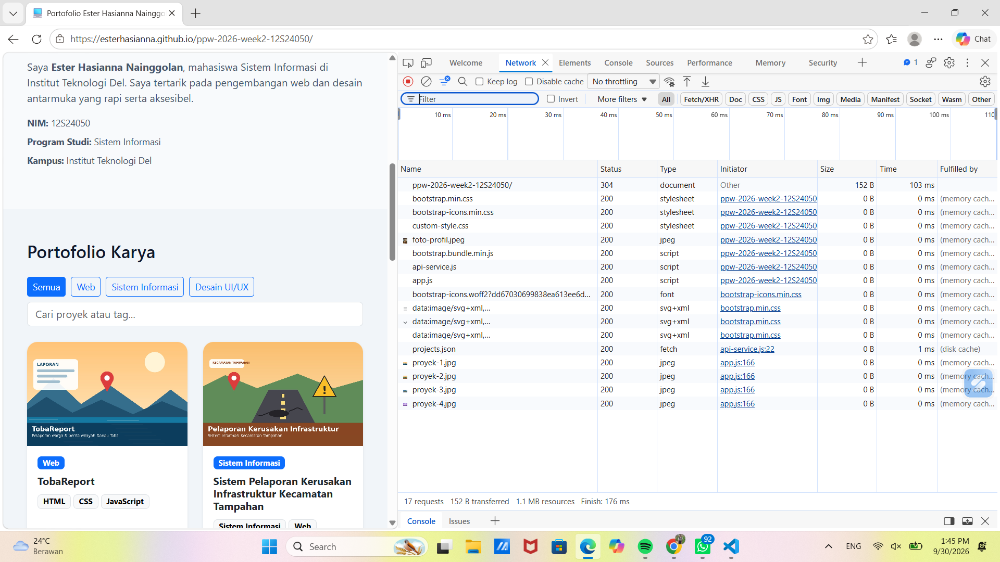

### 6.2 Time to First Byte (TTFB)

| Skenario | X-Cache | TTFB ("Waiting for server response") | Total dokumen |
|---|---|---|---|
| Cold load pertama (edge belum punya salinan) | `MISS` | **312,96 ms** | 319,35 ms |
| Cold load kedua (edge sudah punya salinan) | `HIT` | **60,62 ms** | 62,68 ms |
| Warm load (validasi ETag, status 304) | - | **19,63 ms** | 22,53 ms |

TTFB turun dari ±313 ms menjadi ±61 ms ketika salinan sudah tersimpan di server edge (`X-Cache: HIT`, `X-Served-By: cache-sin-...`, wilayah `southeastasia`). Nilai < 50 ms yang disebut modul untuk Jamstack baru tercapai pada validasi warm (±20 ms) atau ketika koneksi ke edge sangat dekat.

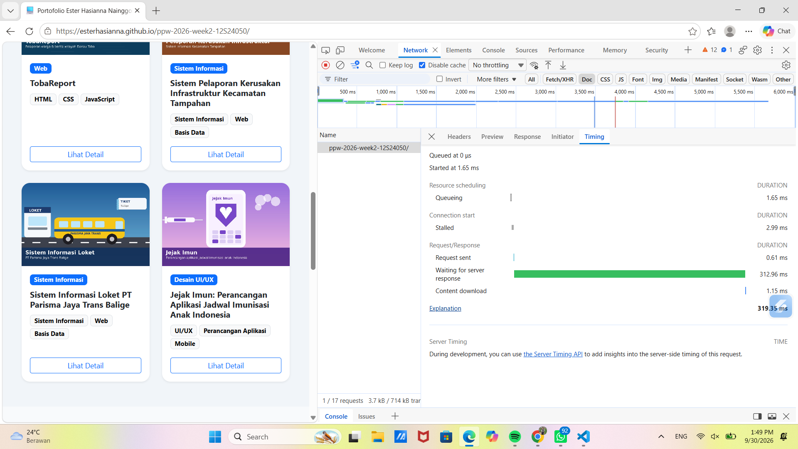

### 6.3 Analisis Waterfall

Urutan pemuatan: dokumen HTML → CSS dan JS (paralel) → `projects.json` → **gambar `proyek-*.jpg` paling akhir**. Gambar kartu baru diminta setelah JavaScript menerima JSON dan merakit DOM, sehingga terbentuk rantai `HTML → app.js → projects.json → gambar`. Ini adalah *trade-off* khas CSR: browser tidak dapat menemukan gambar kartu langsung dari HTML. Berkas terbesar: `foto-profil.jpeg` (176 kB), `bootstrap-icons.woff2` (131 kB), dan empat gambar proyek (78 sampai 89 kB).

### 6.4 Analisis Caching (RFC 9111)

Respons dokumen HTML dari GitHub Pages:

| Header | Nilai | Makna |
|---|---|---|
| `Cache-Control` | `max-age=600` | Salinan lokal dianggap segar selama 600 detik (10 menit) |
| `Expires` | 10 menit setelah `Date` | Konsisten dengan `max-age` |
| `ETag` | `W/"6abcaf44-2a28"` | Validator (*weak*) untuk validasi ulang |
| `Last-Modified` | `Wed, 30 Sep 2026 06:42:12 GMT` | Validator berbasis waktu |
| `Content-Encoding` | `gzip` | Kompresi transfer |
| `Via` / `X-Cache` | `1.1 varnish` / `MISS` lalu `HIT` | Dilayani melalui CDN edge |

Mekanisme **304 Not Modified**: pada warm load (`F5`), browser mengirim *conditional request* dengan `Cache-Control: max-age=0`, `If-None-Match: W/"6abcaf44-2a28"`, dan `If-Modified-Since`. Karena validator cocok, server menjawab `304` tanpa body (142 B) alih-alih mengirim ulang 3,7 kB. Berkas statis lain masih dalam masa `max-age`, sehingga dilayani langsung dari `memory cache` tanpa menyentuh jaringan (0 ms).

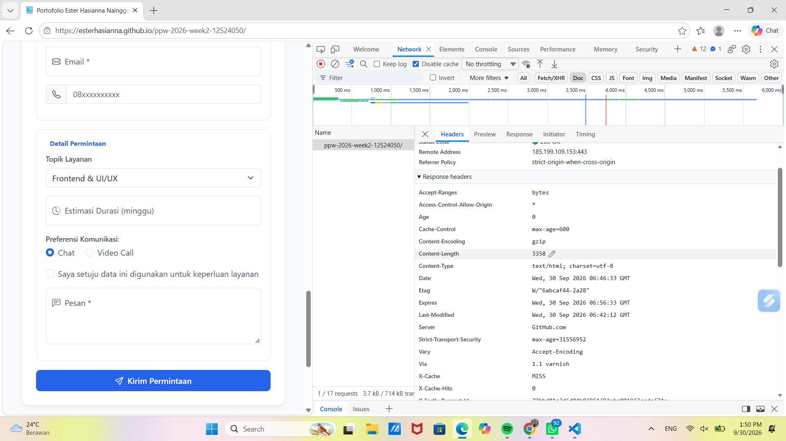
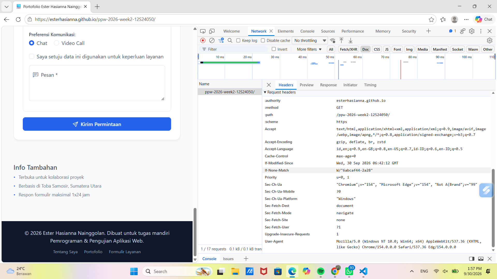

### 6.6 Rekomendasi Optimasi

1. Kompres gambar dan gunakan format WebP (gambar adalah bagian terbesar dari total transfer).
2. Tambahkan `loading="lazy"` pada gambar kartu di luar layar pertama.
3. Pertimbangkan `<link rel="preload">` untuk gambar hero dan `projects.json` agar rantai CSR lebih pendek.
4. Berkas statis pada GitHub Pages memakai `max-age=600`; pada hosting sendiri, atur `Cache-Control` lebih panjang (dengan *cache busting* pada nama berkas) untuk aset yang jarang berubah.

---

## 7. Keamanan Sisi Klien

### 7.1 Pencegahan DOM-based XSS

Data dinamis tidak pernah dimasukkan mentah ke `innerHTML`. Semua nilai (judul, kategori, deskripsi, tag, nama pada riwayat) melewati fungsi `escapeHTML()` yang mengganti `& < > " '` dengan entitas HTML. Nilai yang bersifat pasti teks (misalnya judul modal) memakai `textContent`.

**Pengujian:** kolom *Nama Lengkap* diisi `` lalu formulir dikirim. Hasil: **tidak ada popup**; teks tampil apa adanya pada riwayat pesanan.

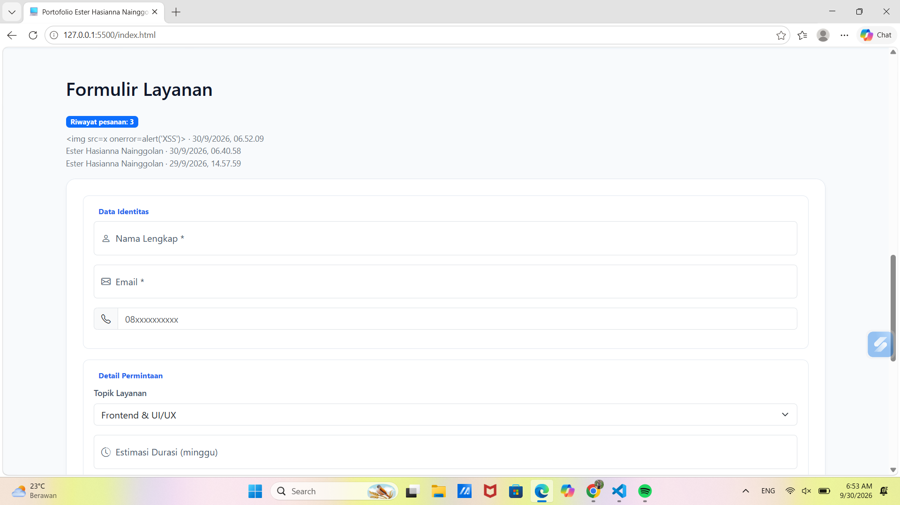

### 7.2 Content Security Policy

Dipasang lewat `<meta http-equiv="Content-Security-Policy">` pada `<head>`:

```
default-src 'self';
script-src 'self' https://cdn.jsdelivr.net;
style-src 'self' 'unsafe-inline' https://cdn.jsdelivr.net;
font-src 'self' https://cdn.jsdelivr.net data:;
img-src 'self' data:;
connect-src 'self' https://jsonplaceholder.typicode.com https://cdn.jsdelivr.net;
object-src 'none';
base-uri 'self';
form-action 'self';
```

| Direktif | Fungsi |
|---|---|
| `script-src 'self' cdn.jsdelivr.net` | Hanya skrip dari situs sendiri dan CDN Bootstrap; **skrip inline dilarang** |
| `connect-src` | `fetch` hanya ke situs sendiri, API tiruan, dan CDN (untuk *source map*) |
| `img-src 'self' data:` | Gambar dari situs sendiri dan ikon/placeholder berformat `data:` |
| `object-src 'none'` | Plugin lama diblokir |
| `base-uri` / `form-action` | Mencegah pembajakan `<base>` dan pengiriman formulir ke domain lain |

**Pengujian:** menyisipkan `<script src="https://example.com/x.js">` lewat Console menghasilkan pesan `Refused to load the script ... violates the following Content Security Policy directive`.

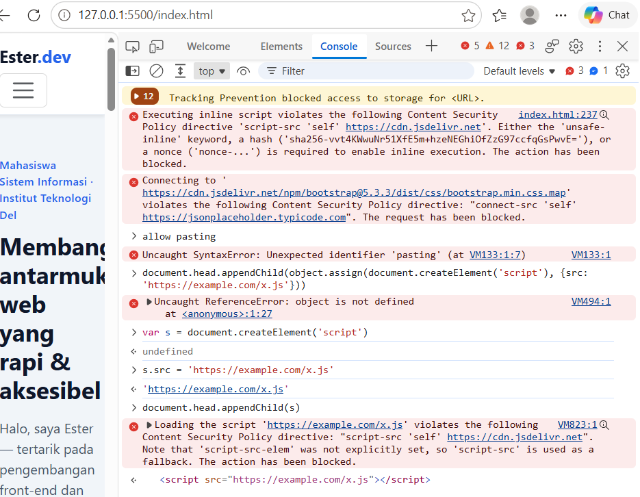

**Keterbatasan:** `style-src 'unsafe-inline'` masih diperlukan karena kartu memakai atribut `style`; direktif seperti `frame-ancestors` tidak dapat diterapkan lewat `<meta>` dan memerlukan header HTTP dari server. Saat pengembangan dengan Live Server, skrip *live reload* yang disisipkan otomatis ditolak CSP (perilaku yang diharapkan dan tidak muncul di GitHub Pages).

---

## 8. Menjalankan Secara Lokal

1. Klon repositori dan pindah ke branch `week4-architecture`.
2. Buka folder di VS Code, lalu jalankan **Live Server** (klik kanan `index.html` → *Open with Live Server*).
3. Buka `http://127.0.0.1:5500/`. Halaman **tidak boleh** dibuka lewat `file://` karena `fetch()` tidak dapat membaca berkas JSON dari skema tersebut.

## 9. Deployment

GitHub Pages: *Settings → Pages → Deploy from a branch → `week4-architecture` / `(root)`*.

## 10. Catatan Data

Nilai `metrics` (durasi, peran, jumlah fitur) dan tautan pada `projects.json` bersifat contoh untuk keperluan demonstrasi arsitektur dan dapat diganti tanpa mengubah kode.

## 11. Riwayat Versi

| Minggu | Isi |
|---|---|
| 2 | Portofolio HTML5 semantik + CSS3 (Flexbox, responsif) |
| 3 | Refactor ke Bootstrap 5.3 dan CSS lanjutan |
| 4 | Arsitektur decoupled multi-tier, Dynamic CSR, Universal Modal, form REST asinkron, profiling jaringan, XSS dan CSP |